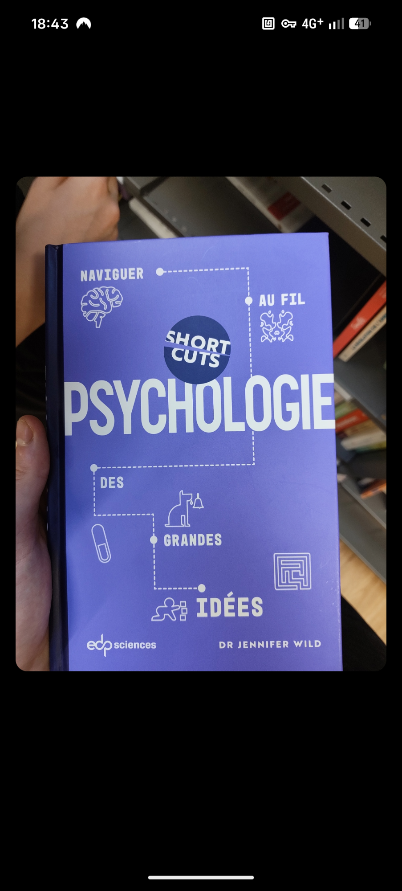

# Short Cuts — Psychologie
## Naviguer au fil des grandes idées

### Identification exacte

| Champ | Valeur |
|-------|--------|
| **Titre complet** | Psychologie : naviguer au fil des grandes idées |
| **Collection** | Short Cuts |
| **Auteur** | Dr Jennifer Wild (Professeure, University of Melbourne / Oxford) |
| **Traducteur** | Benjamin Peylet |
| **Éditeur** | EDP Sciences |
| **Date de parution** | 5 octobre 2023 |
| **ISBN papier** | 978-2-7598-3096-1 |
| **ISBN ebook PDF** | 978-2-7598-3097-8 |
| **DOI** | 10.1051/978-2-7598-3097-8 |
| **Pages** | 160 |
| **Format** | 153 × 234 mm, couleur |
| **Prix** | 19,00 € (papier) / 12,99 € (PDF) |
| **Illustrateur** | Robert Brandt |
| **Directeur artistique** | Luke Herriott |

### Présentation éditoriale

> Comment le cerveau construit-il la mémoire ? Les humains sont-ils tous des moutons ? Comment un enfant voit-il le monde ? Peut-on vivre de pain et d'eau fraîche ? Pourquoi sommes-nous irrationnels ? Quel est le raccourci vers le bonheur ?
>
> Ce livre aborde **8 thématiques** en lien avec la psychologie. Pour chacune, une **carte mentale** permet de se familiariser avec les concepts, suivie d'une série de **questions-réponses illustrées**.

### Table des matières officielle

#### Introduction (p. 6)

#### 1. Psychologie cognitive (p. 8)
- La perception est-elle juste une expérience ? (p. 14)
- Voyons-nous bien ce que nous voyons ? (p. 16)
- Comment le cerveau construit-il la mémoire ? (p. 18)
- Peut-on compter sur votre témoignage ? (p. 20)
- Comment sont stockés nos souvenirs ? (p. 22)
- Y a-t-il foule dans nos têtes ? (p. 24)
- Le raccourci est-il la voie du danger ? (p. 26)

#### 2. Psychologie sociale (p. 28)
- Affichons-nous tous les mêmes émotions ? (p. 34)
- Interviendriez-vous en cas de meurtre ? (p. 36)
- Les humains sont-ils tous des moutons ? (p. 38)
- Quand cessons-nous de suivre les ordres ? (p. 40)
- Est-ce toujours « eux » contre « nous » ? (p. 42)
- Comment les idées s'imposent-elles ? (p. 44)
- Pourquoi as-tu fait ça ? (p. 46)

#### 3. Apprentissage (p. 48)
- Salivez-vous quand sonne l'heure du dîner ? (p. 54)
- Apprenons-nous de nos récompenses ? (p. 56)
- Apprendre est-il un jeu d'imitation ? (p. 58)
- Dix mille heures de pratique feront-elles de vous un génie ? (p. 60)
- Comment un enfant voit-il le monde ? (p. 62)
- Quand dire bye-bye à l'apprentissage d'une langue ? (p. 64)
- Peut-on améliorer sa mémoire ? (p. 66)

#### 4. Psychologie biologique (p. 68)
- Avons-nous bien cinq sens ? (p. 74)
- Vous vous sentez bien ? (p. 76)
- Travaillons-nous mieux sous la pression ? (p. 78)
- Comment les drogues font-elles planer ? (p. 80)
- Comment reconnaître un visage ? (p. 82)
- Comment un taxi se souvient des raccourcis ? (p. 84)

#### 5. Psychologie du développement (p. 86)
- Est-ce que le stress coule aussi les marins ? (p. 92)
- Doit-on être sûr quand on s'attache ? (p. 94)
- Quel âge a l'ego ? (p. 96)
- Pourquoi les bébés aiment-ils les hochets ? (p. 98)
- La sociabilité est-elle un jeu d'enfant ? (p. 100)
- Les enfants lisent-ils dans les pensées ? (p. 102)
- Quel est votre rôle dans le théâtre de la vie ? (p. 104)

#### 6. Différences individuelles (p. 106)
- Peut-on vivre de pain et d'eau fraîche ? (p. 112)
- Sommes-nous plus intelligents qu'avant ? (p. 114)
- Combien y a-t-il d'intelligences ? (p. 116)
- Un bon chef peut-il montrer ses émotions ? (p. 118)
- Comment mesurer la personnalité ? (p. 120)
- Construisons-nous notre propre monde ? (p. 122)

#### 7. Thérapie (p. 124)
- Comment rencontrer son moi idéal ? (p. 130)
- Comment on s'adapte ? (p. 132)
- D'où viennent les pensées négatives ? (p. 134)
- Pourquoi sommes-nous irrationnels ? (p. 136)
- Le comportement modifie-t-il les pensées ? (p. 138)

#### 8. Psychologie positive (p. 140)
- Que valez-vous ? (p. 146)
- Quel est le raccourci vers le bonheur ? (p. 148)
- Changer de mentalité change-t-il l'esprit ? (p. 150)
- Peut-on s'épanouir grâce à la psychologie ? (p. 152)
- Doit-on se laisser porter par le flow ? (p. 154)

#### Annexes
- Pour en savoir plus (p. 156)
- Index (p. 158)
- Remerciements (p. 160)

### Édition originale anglaise

| Champ | Valeur |
|-------|--------|
| Titre | Short Cuts: Psychology |
| Éditeur | Icon Books / UniPress Books Ltd |
| ISBN | 978-1-78578-943-4 |
| Parution | 5 janvier 2023 |
