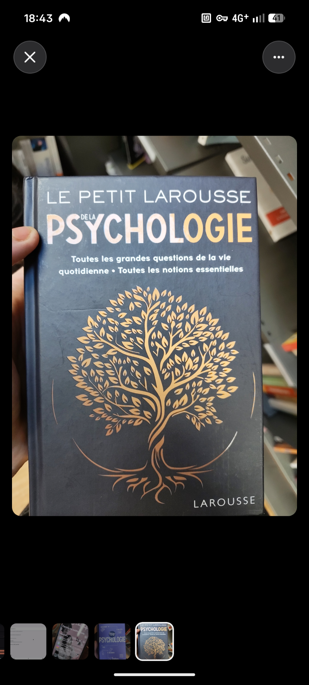

# Le Petit Larousse de la Psychologie

### Identification exacte

| Champ | Valeur |
|-------|--------|
| **Titre complet** | Le Petit Larousse de la psychologie |
| **Sous-titre** | Toutes les grandes questions de la vie quotidienne • Toutes les notions essentielles |
| **Auteurs** | Corinne Antoine, Sylvie Angel (préface) |
| **Éditeur** | Larousse (groupe Hachette Livre) |
| **Collection** | Plus Petit Larousse |
| **Date de parution** | 13 février 2019 |
| **ISBN / EAN** | 978-2-03-596906-4 |
| **Pages** | 934 |
| **Format** | 137 × 198 mm, cartonné |
| **Poids** | 925 g |
| **Prix** | 22,00 € |

### Présentation éditoriale

> Les bases indispensables : une présentation claire et synthétique de la psychologie, de la psychanalyse et de la psychiatrie ; l'histoire, les théories, les maîtres fondateurs.
>
> Les grandes questions de la vie psychologique personnelle, familiale et professionnelle : la charge mentale, le burn-out, l'enfance, la dépression, l'éducation, le vieillissement… toutes les thérapies existantes, de l'analyse à l'hypnose, les pathologies les plus graves. **60 grands dossiers** classés par ordre alphabétique.
>
> Les notions essentielles : d'abandon à zézaiement, en passant par dyslexie, intelligence artificielle, sexualité — **1500 définitions** pour comprendre le sens de mots de plus en plus utilisés.

### Structure de l'ouvrage (3 parties)

#### Partie 1 — Les bases indispensables
- Histoire de la psychologie
- Écoles et courants (psychanalyse, behaviorisme, cognitivisme, humanisme…)
- Grands fondateurs (Freud, Jung, Piaget, Skinner, Rogers, Beck…)
- Méthodes de recherche en psychologie
- Psychiatrie et nosologie (DSM, CIM)

#### Partie 2 — 60 grands dossiers thématiques (A–Z)
Exemples de dossiers :
- Abandon, Addiction, Adolescence, Agoraphobie, Alzheimer
- Anxiété, Attachment (attachement), Autisme, Burn-out
- Charge mentale, Dépression, Divorce, Dyslexie, Éducation
- Harcèlement, Hypnose, Intelligence artificielle, Jalousie
- Ménopause, Narcissisme, Obésité, Parentalité, Phobies
- Sexualité, Stress, Thérapies cognitivo-comportementales
- Vieillissement, Zézaiement…

#### Partie 3 — Dictionnaire (1500 entrées)
De **Abandon** à **Zézaiement**, couvrant :
- Termes cliniques (névrose, psychose, transfert…)
- Concepts cognitifs (mémoire de travail, biais…)
- Vocabulaire du quotidien (charge mentale, FOMO…)
- Acronymes et abréviations (TCC, EMDR, TSA…)

### Éditions antérieures

| Année | ISBN | Pages |
|-------|------|-------|
| 2019 | 9782035969064 | 934 |
| 2013 | 9782035890870 | 173+ |
| 2010 | 9782035854599 | 933 |
| 2008 | 9782035842800 | 933 |

### Avis de lecteurs (Hachette.fr)

- « Un livre qui décrit les maladies, pas un historique complet des grands psychologues »
- « Convient pour un début de cursus, insuffisant à partir de la L3 »
- « Explique les termes les plus utilisés, mais pas assez complet pour le prix »
